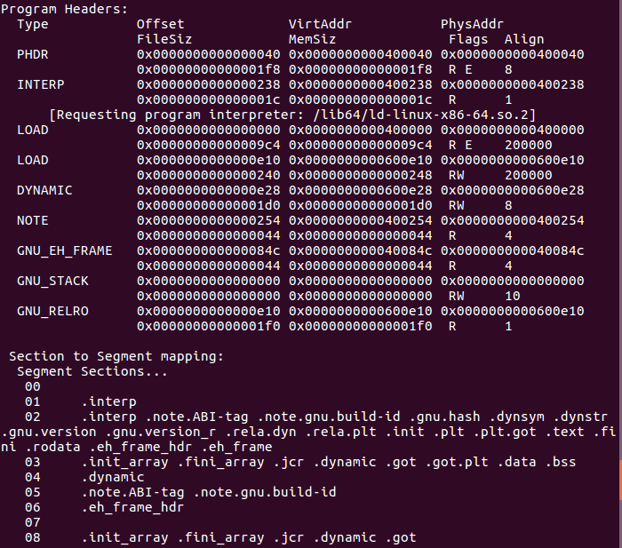
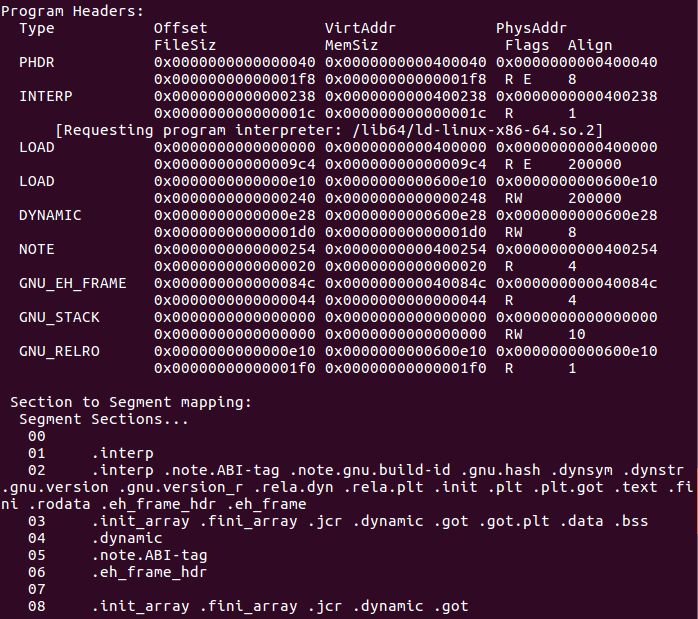

Task 1 -- Play with the program headers
===============================================

# GOAL
The goal of this task is to change the data in ELF file's program/segment header.
In this task, we just change a little that won't affect the running of the program.

# TASK DESCRIPTION
Given a simple program "cb":
There's a read-only program header with type "NOTE"(TODO: Figure out what do different types of headers do)
Originaly, it contains two sections:".note.ABI-tag", ".note.gnu.build-id"
In this task, we will modified this program header so that it only contain one section:".note.ABI-tag"
Here's the readelf output before and after the modification:
Before:


After:


# HINT
1. Check the template_for_task1.py
2. The program header and target section share the same starting address(0x254), so the only thing to change is the size of the program header, so that the new header will cover and only cover the single target section.
3. Find the only target section's size, this would be the exact size of the new program header.

# MY SOLUTION
You can run command:
```
	python my_solution_for_task1.py
```
This will generate the new file "cb_modified"

